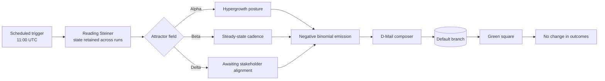

# Divergence Meter

> Future Gadget No. 8. Name subject to change.

A daily observability service that measures the divergence between the worldline
in which meaningful work occurred and the one we are currently in. Readings are
published to `DIVERGENCE.md` and transmitted to the default branch as D-Mail.

**Current attractor field:** Beta
**Reading:** see `DIVERGENCE.md`
**Decisions informed to date:** 0

---

## Executive summary

The department was asked to increase visible output. Visible output has been
increased. Actual output remains at prior levels, which were also zero. We
consider this a successful quarter and have prepared a binder.

## Architecture



## The model

This part is not a joke, which is the joke.

Daily volume is a hidden Markov chain over three attractor fields with negative
binomial emissions. Poisson was rejected: real commit counts are overdispersed,
and an equidispersed model produces a graph with no dead weeks, which is the
single most obvious tell of automation.

| Field | Posture | Mean | Dispersion `k` | Self-transition |
|---|---|---:|---:|---:|
| Alpha | Hypergrowth Operating Posture | 4.6 | 2.2 | 0.70 |
| Beta | Steady-State Delivery Cadence | 2.0 | 1.5 | 0.80 |
| Delta | Awaiting Stakeholder Alignment | 0.10 | 0.8 | 0.78 |

Variance is `μ + μ²/k`. High self-transition is what produces multi-week
sprints and believable vacations. A weekday weight vector suppresses weekends.
The upper tail is truncated at 14 because a freak 30-commit day would blow out
GitHub's quartile thresholds and wash every other day pale.

The chain stores no state. Each run replays the entire worldline from the epoch
(2026-09-09) to recover its present position. This is Reading Steiner, and it is
also the correct engineering call: a scheduled Action gets a fresh checkout every
run, so any stored state would have to be committed, and committing on a
zero-observation day greens the square and destroys the gap the model just
produced. Replay is deterministic, so `simulate.py` shows exactly what will happen.

Simulate a year before committing to a worldline:

```bash
python3 simulate.py 1048596
```

## Convergence points

Dates on which the attractor field is overridden by departmental mandate.

| Date | Event | Effect |
|---|---|---|
| 13 Oct | Treat Yo Self | Forced Alpha, 1.8× |
| 14 Feb | Galentine's Day | Forced Alpha, 1.4× |
| 28 Jul | Time Travel Symposium | 1.6×, field unstable |
| 24 Jan | Swanson directive | Forced Delta, output suppressed |

## Service level objectives

| Objective | Target | Actual |
|---|---|---|
| Squares greened | sampled days only | ~45% of the year |
| Business value delivered | 0 | 0 |
| Unplanned insight | 0 | 0 |
| Mean time to syrup | < 4 min | 2 min |

## On-call rotation

Jerry Gergich. His name is spelled differently in every readout. This is
intentional and will not be corrected.

## Roadmap

- [x] Phase 1: Emit observations
- [ ] Phase 2: ML-driven synergy attribution
- [ ] Phase 3: Reach the Steins;Gate worldline (divergence ≥ 1.048596)
- [ ] Phase 4: Sunset Phase 2 without ever having started it
- [ ] Phase 5: Fourth cone

## Non-goals

- Producing software
- Being useful
- Backdating commits to fabricate history that did not occur

That last one is load-bearing. Generating tomorrow's noise is a bit.
Retroactively inventing a year you did not work is a lie, and it is trivially
visible in commit metadata anyway. This repository only ever moves forward.

## Setup

1. Set repository variable `LAB_MEMBER_EMAIL` to an email verified on your
   GitHub account, or your `@users.noreply.github.com` address. Without it the
   workflow fails loudly, because a commit authored by anyone else greens
   nothing.
2. Optionally set `LAB_MEMBER_NAME`.
3. The repository must not be a fork, and commits must land on the default branch.

Scheduled workflows are disabled after 60 days of repository inactivity, and
pushes made with `GITHUB_TOKEN` may not reset that clock. If the meter goes
quiet, this is the first thing to check.

---

This program does nothing. That is the point.

El psy kongroo.
